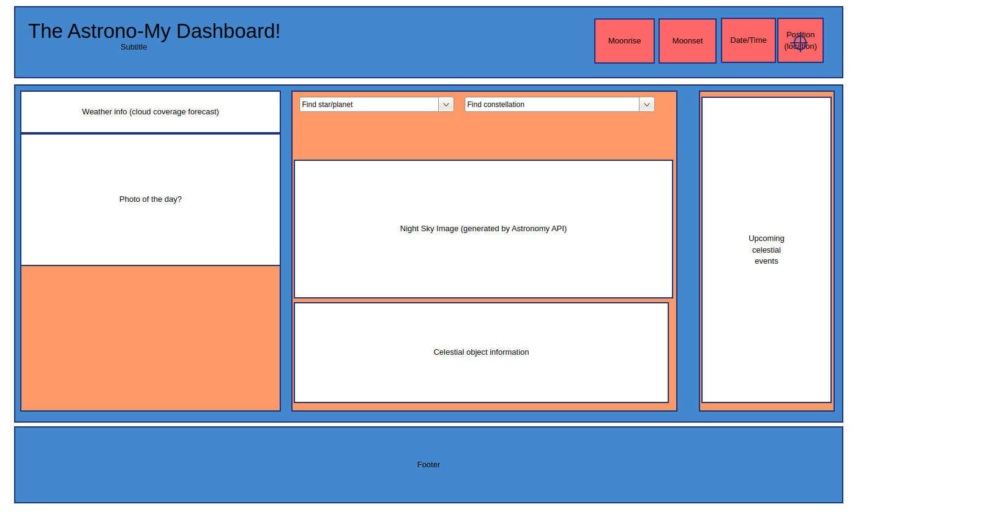

# Project Title - Astrono-MyDashboard

## Project Description:
Using available open astronomy and NASA APIs, we will build a simple dashboard that will use location data to pinpoint the night sky and any astonomical events which are upcoming, such as:
- Lunar Eclipses
- Meteor Showers
- Planetary locations
- Moon/planet rising & setting
- and many more!

## User Story

As a USER, I want a dashboard to provide interesting or notable celestial events happening in my area. I can also select a celestial body (Star, planet, constellation) and a map will centre and information about that body will be displayed.

## Wireframe of interface

## APIs being used
Initial data - 

- Astronomy API https://docs.astronomyapi.com
- NASA - https://api.nasa.gov
- CSA - https://www.asc-csa.gc.ca/eng/open-data/api.asp

## Rough Breakdown of Tasks

See our GitHub project at https://github.com/users/omgthegreenranger/projects/1/views/1

Repository is https://github.com/omgthegreenranger/Astrono-MyDashboard
